  

# 🔍 Awesome Search Engine 🚀

  
  
  
  

## 📌 Top Search Engine Ecosystem & Market Overview

**Curated List of Commercial Search Engines & Open-Source GitHub Projects**  
*Focused on Web Search, Self-Hosted Metasearch & Privacy-Respecting Indexes*  

> **Last updated: October 2026** 📅

This repository tracks notable **commercial search engines** and **open-source projects** that index, retrieve, and rank web content — from global search giants to self-hosted metasearch engines and decentralized index efforts.

---

## 📈 Market Dynamics & Industry Overview

> **Market Size & Structure**: The global search engine market is estimated at **~$200 Billion to $230 Billion** annually in search advertising and indexing services. The industry is **highly concentrated** (a classic *winner-take-all* market), with Google holding over 90% of global web search volume. Bing holds ~3–4%, while alternative privacy engines and localized platforms compete for the remaining market share.

---

## 💡 Key Highlights

- **Commercial Leaders 🌐**: Includes Google Search, Bing Search, DuckDuckGo, Yahoo Search, Yandex, Baidu, Ecosia, Startpage, Brave Search, and Qwant.
- **Open-Source Emphasis 🔓**: Building a web-scale search index requires massive crawl infrastructure. However, **SearXNG**, **Whoogle**, **4get**, and **LibreY** provide privacy-respecting metasearch over existing indexes, while **Stract** and **Marginalia** build independent open-source indexes, and engines like **Meilisearch**, **Typesense**, and **OpenSearch** power enterprise & app search.

Contributions welcome! 🤝 Open a PR to add/update entries. Please keep descriptions factual and link to official sites.

---

## 📚 Table of Contents

- [🏢 Commercial & SaaS Platforms](#-commercial--saas-platforms)
- [🔓 Open-Source GitHub Projects](#-open-source-github-projects)
- [🤝 How to Contribute](#-how-to-contribute)
- [⚠️ Disclaimer](#%EF%B8%8F-disclaimer)
- [⭐ Star History](#-star-history)
- [💖 Support & Community](#-support--community)

---

## 🏢 Commercial & SaaS Platforms

The table below summarizes leading commercial search engines and hosted search platforms, sorted by estimated company market valuation / annual search revenue (descending).

| Platform 🌐 | Starting Tier Price 💵 | Free Tier Limit 🎁 | Company Scale (Valuation / Revenue) 📊 | Highlights & Description 📝 |
| :--- | :--- | :--- | :--- | :--- |
| **[Google Search](https://www.google.com/)** | $5.00 / 1,000 queries (Custom Search JSON API) | Free for web search; 100 queries/day free for Search API | **~$2.0 Trillion** (Alphabet Inc. Market Cap) | **The dominant search engine** with 90%+ global market share, unparalleled index depth, and advanced ranking signals. Proprietary algorithms and deep AI integration. |
| **[Bing Search](https://www.bing.com/)** | $15.00 / 1,000 queries (Bing Web Search API v7) | Free for web search; 1,000 transactions/month free for Web Search API | **~$3.1 Trillion** (Microsoft Corp. Market Cap) | Microsoft's search engine powering DuckDuckGo, Yahoo, and Ecosia results. **The primary alternative index** to Google with AI-powered Copilot integration. |
| **[Baidu](https://www.baidu.com/)** | $0.002 / call (Baidu Search API) | Free for web search; 50,000 free quota points upon registration | **~$30 Billion** (Baidu Inc. Market Cap) | China's dominant search engine with **the best index for Chinese-language content**. Essential for reaching Chinese web markets. |
| **[Yandex](https://yandex.com/)** | $4.00 / 1,000 requests (Yandex Search API) | Free for web search; 1,000 queries/day free for Yandex Search API | **~$10 Billion** (Yandex N.V. / Nebius Group Valuation) | Russia's dominant search engine with **the best index for Russian-language content** and strong performance in Eastern Europe and Central Asia. |
| **[Yahoo Search](https://search.yahoo.com/)** | N/A (Web portal search only) | Free web search (Ad-supported) | **~$5 Billion** (Apollo Global Management Acquisition) | Yahoo's search portal powered by Bing results. **Historically significant** as one of the earliest web directories (founded 1994). Now primarily a Bing syndication surface. |
| **[Brave Search](https://search.brave.com/)** | $3.00 / 1,000 queries (Brave Search API) | Free for web search; $5.00 free monthly credit (~2,000 queries) for Search API | **~$1.5 Billion** (Brave Software Private Valuation) | **The leading independent search index** from Brave Software — not a Bing or Google proxy. **Privacy-first with its own crawler and ranking**. |
| **[DuckDuckGo](https://duckduckgo.com/)** | N/A (Consumer search engine) | Completely free for web search (Ad-supported privacy engine) | **~$1.0 Billion** (DuckDuckGo Inc. Private Valuation) | **The leading privacy-focused search engine** — no tracking, no search history, no filter bubble. Uses Bing's index with DuckDuckGo's own ranking and Instant Answers. |
| **[Ecosia](https://www.ecosia.org/)** | N/A (Consumer search engine) | Completely free for web search (Ad-supported eco-search) | **~$100 Million** (Annual Search Revenue for Reforestation) | Privacy-friendly search engine that **plants trees with ad revenue** — over 200 million trees planted. Powered by Bing results. |
| **[Startpage](https://www.startpage.com/)** | N/A (Consumer search engine) | Completely free for web search (Privacy ad-supported) | **~$50 Million** (System1 / Startpage Valuation) | Privacy-focused search engine offering **Google-quality results without Google tracking**. **The only way to get Google's index with privacy**. |
| **[Qwant](https://www.qwant.com/)** | N/A (Consumer search engine) | Completely free for web search (GDPR compliant) | **~$30 Million** (Qwant SAS Company Valuation) | French privacy-focused search engine with **European data sovereignty** and its own index in partnership with Bing. **Best for European users**. |

---

## 🔓 Open-Source GitHub Projects

The following list of open-source search engines, metasearch proxies, and application search frameworks is sorted by GitHub star count (descending).

- **[Meilisearch](https://github.com/meilisearch/meilisearch)**  ⚡  
  **Lightning-fast, open-source search engine for applications**, MIT licensed. **Not a web search engine** — it's a search API for your own data. Typo-tolerant, faceted search with instant results. **The leading open-source alternative to Algolia**.

- **[SearXNG](https://github.com/searxng/searxng)**  🛡️  
  **The leading open-source metasearch engine**, AGPL-3.0 licensed. **Aggregates results from 70+ search engines** — Google, Bing, DuckDuckGo, Wikipedia, and more — without tracking users. Self-hostable via Docker with result filtering, safe search, and JSON API.

- **[Typesense](https://github.com/typesense/typesense)**  🚀  
  **Open-source, typo-tolerant search engine for applications**, GPL-3.0 licensed. Fast, relevant, and easy to deploy. The main open-source competitor to Meilisearch for site search, e-commerce, and app search.

- **[ZincSearch](https://github.com/zinclabs/zincsearch)**  📦  
  **Lightweight search engine & Elasticsearch alternative in Go**, Apache-2.0 licensed. Requires low memory footprint, features built-in UI, and provides fast full-text search indexing.

- **[OpenSearch](https://github.com/opensearch-project/OpenSearch)**  📊  
  **Apache 2.0 licensed community fork of Elasticsearch** with search and analytics capabilities. Designed for log analytics, enterprise search, and application observability.

- **[Manticore Search](https://github.com/manticoresoftware/manticoresearch)**  ⚡  
  **Fast open-source database for search and analytics**, GPL-2.0 licensed. Successor to Sphinx search, offering high-throughput full-text search, vector search integration, and SQL API support.

- **[Quickwit](https://github.com/quickwit-oss/quickwit)**  🦀  
  **Cloud-native search engine for logs and trace indexing in Rust**, AGPL-3.0 licensed. Sub-second search engine optimized for Amazon S3 & cloud storage with high indexing throughput.

- **[Whoogle Search](https://github.com/benbusby/whoogle-search)**  🔒  
  **Self-hosted, ad-free, privacy-respecting metasearch engine that uses Google results**, MIT licensed. Strips Google's tracking, ads, and AMP. Requires no JavaScript and supports single-click Docker deployment.

- **[Vespa](https://github.com/vespa-engine/vespa)**  🧠  
  **Open-source big data serving engine for search & vector retrieval**, Apache-2.0 licensed created by Yahoo. Scalable search engine supporting vector search, AI ranking, and real-time computation over massive datasets.

- **[YaCy](https://github.com/yacy/yacy_search_server)**  🌐  
  **Decentralized peer-to-peer web search engine**, GPL-2.0 licensed. Operates without a central server — every peer crawls and indexes independently, sharing search results across a p2p network.

- **[Stract](https://github.com/StractOrg/stract)**  🏗️  
  **Independent open-source search engine with its own web index**, AGPL-3.0 licensed. Crawls and ranks web pages independently rather than proxying external commercial search engines.

- **[Marginalia Search](https://github.com/MarginaliaSearch/MarginaliaSearch)**  📜  
  **Independent search engine focused on non-commercial web content**, AGPL-3.0 licensed. Indexes text-heavy personal blogs, forums, and historical web pages, promoting an anti-SEO discovery experience.

- **[Gigablast](https://github.com/gigablast/open-source-search-engine)**  🏛️  
  **Open-source C/C++ web search engine and indexer**, Apache-2.0 licensed. Historically significant standalone web search engine baseline built for high scalability.

- **[MetaGer](https://github.com/Orbiter/MetaGer)**  🛡️  
  **German non-profit privacy metasearch engine**, SUMA-EV open-source project. Aggregates major search indexes with integrated Tor routing option and green energy hosting.

- **[LibreY](https://github.com/Ahwxorg/LibreY)**  🍃  
  **Minimalist privacy metasearch engine** supporting multiple search engines, torrent search, and media extraction without user tracking.

- **[Common Crawl Index](https://github.com/commoncrawl/cc-index-table)**  🗄️  
  **Open repository of web crawl data**, providing petabytes of raw web pages, columnar index tables, and parsing utilities for web search engine builders.

- **[4get](https://github.com/4get-org/4get)** 🍃  
  **Lightweight, privacy-focused PHP metasearch engine**, AGPL-3.0 licensed. Focuses on minimal memory usage and rapid self-hosted deployment.

---

### 💡 Additional Open-Source & Independent Mentionables

- **Presearch** — Decentralized search engine with community node infrastructure.
- **Mojeek** — Independent UK web search engine operating its own crawler and index.
- **Alexandria** — Open-source search experiment built on Common Crawl web data.

---

## ⚙️ Architectural Comparison: Web Search vs. Application Search

When choosing an open-source search solution:
1. **Privacy Metasearch**: Deploy **SearXNG** or **Whoogle** to proxy Google/Bing without tracking user queries.
2. **Independent Web Indexing**: Explore **Stract** or **Marginalia Search** for independent web crawling.
3. **Application & Site Search**: Use **Meilisearch**, **Typesense**, or **Manticore Search** as fast, developer-friendly Algolia alternatives.
4. **Log Analytics & Cloud Traces**: Use **OpenSearch**, **Quickwit**, or **ZincSearch**.

---

## 🤝 How to Contribute

We welcome community contributions! Follow these simple steps:

1. 🍴 **Fork** the repository.
2. 📝 **Add/edit** entries in `README.md` using the established Markdown format.
3. 🔍 **Provide key detail**: Name, official URL, concise description, and license/pricing model.
4. 📥 **Submit a Pull Request (PR)** with a clear title and brief explanation.

Don't forget to **Star ⭐** the repository if you find it helpful!

---

## ⚠️ Disclaimer

- This list is **community-curated** for educational, privacy, and research purposes.
- **Metasearch engines rely on third-party APIs**: Proxies like SearXNG or Whoogle depend on upstream indexes (Google/Bing/DuckDuckGo).
- **Application search engines are not web crawlers**: Engines like Meilisearch and Typesense index internal database records rather than crawling the public web.

---

## ⭐ Star History

---

## 💖 Support & Community

If you find this repository valuable, please consider supporting the project! Your contributions and stars help maintain and expand this search ecosystem list.

- ⭐ **Star** this repository on GitHub.
- 🔀 **Fork** and contribute new search engines or tools.
- 📢 **Share** with privacy advocates, developers, and search enthusiasts.
- ☕ **Buy me a coffee / Sponsor**: Support ongoing maintenance on the [GitHub Sponsor Dashboard](https://github.com/sponsors/ishandutta2007).

---

**Made with ❤️ for privacy advocates, search engineers, and open-source developers.**
